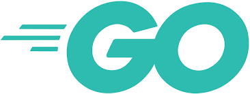
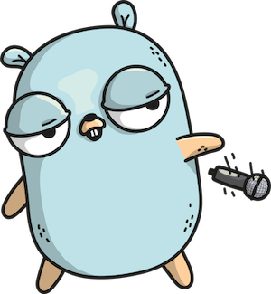

# SFEIR SCHOOL GOLANG

## A mascot

Original Gopher by [Rene French](https://www.instagram.com/reneefrench)
and drawn here by [Ashley Mc Namara](https://twitter.com/ashleymcnamara/status/860462810819702784?s=20)

## Open knowledge

A [SFEIR School](https://www.sfeir.com/formation/school/)

## GO-100

GO-100 is a directed tour of the language, see [Go tour](https://tour.golang.org/list).
The purpose of this first course is to learn the basics of the language to be able to build simple application.

The GO-100 slides are available [here](https://docs.google.com/presentation/d/1BaGmu3G5NuyClf-_ca4Eiix93WeNeabd_U7zi_HCWDo/edit?usp=sharing).

## GO-200

GO-200 will guide you through the building of a standard REST web service as a CRUD API using for a todolist.
You will learn how to process command line arguments, setup persistence and expose HTTP endpoints.

The GO-200 slides are available [here](https://docs.google.com/presentation/d/1OjEuUvuFFCC2o-g4HE7-e9BhIfdW4gzIr2buIuBpsCw/edit?usp=sharing).
